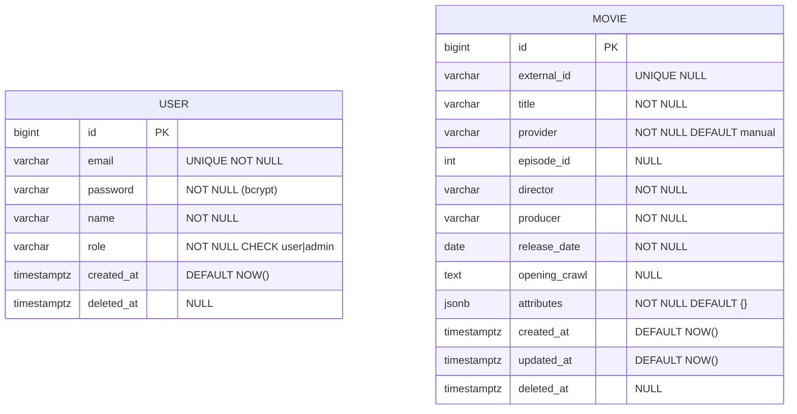

# Modelo de Datos — API de Gestión de Películas

> Documento de diseño. Es la propuesta del DER para implementar el backend. Cambiá lo que no cierre y lo iteramos.
>
> Construido sobre [`ENDPOINTS.md`](./ENDPOINTS.md): toda decisión de schema responde a un contrato ya definido. Si encontrás inconsistencia, **ENDPOINTS.md gana** (es el contrato HTTP); ajustá el DER.

---

## 1. Convenciones del modelo

| Tema | Decisión |
|---|---|
| IDs de entidad | `BIGSERIAL` (PostgreSQL `bigint` autoincremental). Nunca UUID para entidades (los `traceId` de request son UUID v4 pero no persisten). |
| Timestamps | `TIMESTAMPTZ` (UTC) en todas las columnas de tiempo. `createdAt` y `updatedAt` los maneja TypeORM (`@CreateDateColumn`, `@UpdateDateColumn`). |
| Naming | `snake_case` en DB (columnas, tablas, índices). `camelCase` en TypeScript. Estrategia `SnakeNamingStrategy` configurada global para no repetir `@Column({ name })`. |
| Soft delete | `deletedAt TIMESTAMPTZ NULL`. Toda query del módulo filtra `WHERE deleted_at IS NULL` (vía índice parcial). |
| Enums | `VARCHAR + CHECK constraint` (no `CREATE TYPE ... AS ENUM`). Más flexible para agregar valores. |
| JSONB | Default `'{}'::jsonb` (no `NULL`) para evitar null-checks. Validación de shape a nivel app. |
| Foreign keys | **Ninguna**. No hay relación `User ↔ Movie`. |
| Sync state | **No se persiste**. Mutex en memoria (single-instance). |

> **Decisión — sin FK User ↔ Movie:** el dominio no modela "usuario posee película". Los admins crean/editan pero eso no persiste relación (no hay audit trail). Si en el futuro se quiere audit, se agregan `created_by_user_id` y `updated_by_user_id` con FK. Hoy fuera de scope (challenge 4h).

---

## 2. Diagrama ER



No hay línea de relación entre `USER` y `MOVIE` (no hay FK en el schema ni en el dominio).

---

## 3. Entidad `User`

| Columna | Tipo PG | Constraints | Notas |
|---|---|---|---|
| `id` | `BIGSERIAL` | PK | |
| `email` | `VARCHAR(254)` | `UNIQUE NOT NULL` | Normalizado en app: `trim → NFKC → lowercase` antes de INSERT. Ver ENDPOINTS §2 "email normalization". |
| `password` | `VARCHAR(255)` | `NOT NULL` | Hash bcrypt cost 10. Nunca se loguea ni devuelve. Storage con headroom (bcrypt = 60 chars, argon2 ~95). |
| `name` | `VARCHAR(100)` | `NOT NULL` | Validación 2-100 chars en app (class-validator). |
| `role` | `VARCHAR(20)` | `NOT NULL CHECK (role IN ('user','admin'))` | Default `'user'` en signup. Admins solo por seed/CLI/DB. |
| `created_at` | `TIMESTAMPTZ` | `NOT NULL DEFAULT NOW()` | TypeORM `@CreateDateColumn`. |
| `deleted_at` | `TIMESTAMPTZ` | `NULL` | Soft delete. Login bloqueado si `IS NOT NULL` (ver ENDPOINTS §2). |

> **Decisión — `email` UNIQUE global (no parcial):** un usuario soft-deleted **no puede re-registrarse** con el mismo email (signup devuelve `400` genérico indistinguible de validación de formato). Esto evita user enumeration (atacante no detecta "email existe pero está soft-deleted"). Coherente con ENDPOINTS §2 "evitar user enumeration".
>
> Si en el futuro se quiere permitir re-registro tras soft-delete, se cambia a índice parcial `UNIQUE WHERE deleted_at IS NULL`. Por ahora: constraint global.

> **Decisión — `role` sin PG ENUM:** el type `pg_enum` requiere `ALTER TYPE ADD VALUE` (con quirks de transacción) para agregar un valor futuro. `VARCHAR + CHECK` se cambia con un `ALTER TABLE DROP CONSTRAINT ... ADD CONSTRAINT ...` simple. Más mantenible para 4h y para iteraciones futuras.

> **Decisión — `password` VARCHAR(255):** bcrypt = 60 chars, argon2 ~95 chars (base64). `255` da headroom para futuros algoritmos sin migration.

---

## 4. Entidad `Movie`

| Columna | Tipo PG | Constraints | Notas |
|---|---|---|---|
| `id` | `BIGSERIAL` | PK | |
| `external_id` | `VARCHAR(100)` | `NULL` | Identidad única **dentro del provider**. N NULLs OK (la unicidad compuesta solo aplica cuando `external_id IS NOT NULL` — índice parcial). Es el `uid` de SWAPI cuando `provider='swapi'`. |
| `title` | `VARCHAR(200)` | `NOT NULL` | |
| `provider` | `VARCHAR(50)` | `NOT NULL DEFAULT 'manual'` | Origen. `'manual'` para POST sin `external_id`, `'swapi'` para sync (set explícito en `SyncMoviesService`). |
| `episode_id` | `INT` | `NULL` | Característica opcional. NO UNIQUE (dos manuales pueden compartir). Validación 1-20 en app. |
| `director` | `VARCHAR(100)` | `NOT NULL` | Buscado en `GET /movies?search=`. Indexado con GIN trgm. |
| `producer` | `VARCHAR(200)` | `NOT NULL` | |
| `release_date` | `DATE` | `NOT NULL` | ISO 8601 `YYYY-MM-DD`. Ordenable. Indexado con B-tree. |
| `opening_crawl` | `TEXT` | `NULL` | Hasta 5000 chars validado en app. |
| `attributes` | `JSONB` | `NOT NULL DEFAULT '{}'::jsonb` | Datos opacos por provider. Hoy: arrays de URLs de SWAPI. Mañana: campos únicos de futuros providers. Validación de shape a nivel app, no en DB. |
| `created_at` | `TIMESTAMPTZ` | `NOT NULL DEFAULT NOW()` | TypeORM `@CreateDateColumn`. |
| `updated_at` | `TIMESTAMPTZ` | `NOT NULL DEFAULT NOW()` | TypeORM `@UpdateDateColumn` (auto-update en cada `save()`). |
| `deleted_at` | `TIMESTAMPTZ` | `NULL` | Soft delete. Filtrado en toda query del módulo. |

### Shape de `attributes` JSONB (SWAPI)

```json
{
  "characters": ["https://swapi.tech/api/people/1", "https://swapi.tech/api/people/2"],
  "planets":    ["https://swapi.tech/api/planets/1"],
  "starships":  ["https://swapi.tech/api/starships/12"],
  "vehicles":   [],
  "species":    ["https://swapi.tech/api/species/1"]
}
```

Arrays vacíos permitidos. El shape se valida en `SyncMoviesService` antes de persistir; la DB no enforza estructura.

Películas manuales tienen `attributes = {}`. Películas SWAPI-sourced tienen los 5 keys poblados (algunos pueden ser `[]` si SWAPI no devuelve nada).

> **Decisión — campos fijos vs JSONB:** los campos consultados/search/sort (`title`, `director`, `release_date`, `episode_id`) son **fijos** (columnas tipadas con índices). El resto (`opening_crawl`, arrays de URLs) va a JSONB. Permite:
> - Search/sort performante con índices estándar (GIN trgm, B-tree).
> - Validación declarativa con class-validator en las columnas fijas.
> - Extensibilidad de provider: si sumamos Marvel con campos solapados (`director`, `releaseDate`), escriben a las mismas columnas. Si tiene campos únicos, van al JSONB.
>
> Trade-off aceptado: agregar columna fija nueva requiere migration. Para 4h + scope actual (SWAPI only) es preferible a JSONB-puro (costo de search/sort/validation).

> **Decisión — `episode_id` NO UNIQUE:** es el número de episodio de la saga (4, 5, 6, 1, 2, 3 según orden narrativo Star Wars). Es **característica**, no identidad. La identidad la da `external_id`. Dos manuales con `episode_id=4` son válidas. Coherente con ENDPOINTS §3.

> **Decisión — `attributes` default `'{}'::jsonb`:** usamos default en vez de permitir NULL. Razones:
> - Evita null-checks en código (`movie.attributes ?? {}`).
> - Garantiza que toda película tiene un contenedor (vacío OK).
> - Coherencia: manual sin sync = `{}`. SWAPI-sourced = `{characters: [...], ...}`.

> **Decisión — `provider` default `'manual'`:** default seguro (sin fuente externa). `SyncMoviesService` setea `'swapi'` explícito al INSERT. Reactivación (POST con `external_id` matcheando soft-deleted) preserva el provider original (no se pisa).

> **Decisión — `provider` inmutable después del POST:** una vez creada la película con un `provider`, ese campo no se puede modificar vía `PATCH`. La motivación es la misma que `external_id`: preserva la identidad de origen. Para "cambiar" el `provider`, hay que hacer `DELETE` + `POST` (manual) o esperar a que el sync lo reinserte (si `provider='swapi'` y SWAPI lo vuelve a traer, no se reactiva por design — ver §4 ENDPOINTS).

> **Decisión — unicidad compuesta `(provider, external_id)`:** la unicidad es `(provider, external_id) UNIQUE WHERE external_id IS NOT NULL` (índice parcial). Esto:
> - Permite múltiples NULLs en `external_id` (películas manuales sin fuente externa).
> - Permite que dos providers distintos tengan el mismo `external_id` (futuro: `'swapi':'abc'` vs `'marvel':'abc'` no colisionan).
> - El `POST /movies` opera dentro del namespace `provider='manual'`. El sync opera dentro del namespace `provider='swapi'`. Las dos vías no se pisan entre providers.
> - Reactivación de soft-deleted aplica solo dentro del mismo provider: POST reactiva manuales soft-deleted; sync **no** reactiva SWAPI soft-deleted por design (ver §4 ENDPOINTS).

---

## 5. Relaciones

**No hay FK** entre `User` y `Movie`. El dominio no modela "usuario posee película".

Si en el futuro se quiere:
- **Audit trail:** agregar `created_by_user_id BIGINT NULL REFERENCES users(id)` y `updated_by_user_id BIGINT NULL REFERENCES users(id)`. Fuera de scope 4h.
- **Listar "películas vistas por user":** requiere tabla aparte (`movie_views (user_id, movie_id, viewed_at)`). No está en el requirement.

---

## 6. Índices

```sql
-- User
CREATE UNIQUE INDEX users_email_idx ON users (email);

-- Movie
CREATE UNIQUE INDEX movies_provider_external_id_idx ON movies (provider, external_id)
  WHERE external_id IS NOT NULL;
-- Unicidad compuesta (provider, external_id). Índice parcial: solo aplica cuando external_id no es NULL.
-- Múltiples NULLs en external_id son válidos (películas manuales sin fuente).

CREATE INDEX movies_title_trgm_idx ON movies
  USING gin (title gin_trgm_ops)
  WHERE deleted_at IS NULL;

CREATE INDEX movies_director_trgm_idx ON movies
  USING gin (director gin_trgm_ops)
  WHERE deleted_at IS NULL;

CREATE INDEX movies_episode_id_idx ON movies (episode_id)
  WHERE deleted_at IS NULL;

CREATE INDEX movies_release_date_idx ON movies (release_date)
  WHERE deleted_at IS NULL;
```

> **Decisión — todos los índices de Movie son parciales `WHERE deleted_at IS NULL`:** las queries activas nunca tocan soft-deleted, así que el índice solo cubre filas relevantes. Resultado: índice más chico, mejor selectivity, planner elige mejor. Soft-delete (`UPDATE deleted_at = NOW()`) quita la fila del índice automáticamente.

> **Decisión — la unicidad compuesta `(provider, external_id)` es índice parcial `WHERE external_id IS NOT NULL`:** la unicidad solo aplica cuando hay `external_id`. Películas manuales con `external_id=NULL` no entran al constraint. Esto coincide con el default de PG (`UNIQUE` permite N NULLs) pero lo hacemos explícito vía índice parcial — y el orden de columnas (`provider` primero, `external_id` después) soporta queries por `provider` solo (futuro: listar todas las películas `'swapi'`, etc.).

> **Decisión — sin índice sobre `Movie.attributes`:** los valores en `attributes` (URLs, etc.) nunca se consultan con `WHERE` o `ORDER BY` en el contrato actual. Si en el futuro se necesita buscar por `attributes->>'characters'` o similar, se agrega un índice funcional en ese momento (YAGNI).

> **Decisión — sin índice sobre `Movie.created_at` / `updated_at`:** no son criterios de sortBy ni filterBy en el contrato actual (ENDPOINTS §3). Si se agregan, se indexan.

> **Decisión — `User` solo tiene índice UNIQUE en `email`:** el login busca por email (UNIQUE, suficiente). El filtro `deleted_at IS NULL` aplica en runtime; no necesita índice dedicado porque la cardinalidad de users activos es baja y el UNIQUE en email ya es restrictivo. Si la tabla crece y el login se vuelve lento, se agrega `CREATE INDEX users_email_active_idx ON users (email) WHERE deleted_at IS NULL`.

---

## 7. Decisiones DER ↔ ENDPOINTS cross-check

| Decisión DER | Sección ENDPOINTS | Coherencia |
|---|---|---|
| `User.email` UNIQUE global | §2 signup ("evitar user enumeration") | ✓ |
| `User.role` VARCHAR+CHECK | §1 convenciones (roles) | ✓ |
| `User.deletedAt` filtra login | §2 login (cuenta deshabilitada → 401) | ✓ |
| `Movie.external_id` UNIQUE compuesto `(provider, external_id)` WHERE `external_id IS NOT NULL` | §1 convenciones (External ID) | ✓ |
| `Movie.episode_id` NO UNIQUE | §3 POST/PATCH (episode_id es característica) | ✓ |
| `Movie.deletedAt` filtra toda query | §3 GET/POST/PATCH/DELETE (soft delete invisible) | ✓ |
| Strings persistidos sin normalización | §3 "strings persistidos sin normalización" | ✓ |
| `Movie.attributes` JSONB para SWAPI URLs | §3 GET /movies/:id (devuelve characters/planets/etc) | ✓ |
| `Movie.provider` para tracking | (nuevo, agregado por DER para extensibilidad) | nuevo |
| Sin SyncState table | §4 sync (mutex en memoria) | ✓ |
| Sin audit log / sin `createdBy` | (decisión consciente, fuera de scope) | nuevo |

---

## 8. Lo que NO está en el DER (por scope)

- ❌ **Audit log** (`movie_changes`, `user_changes`): no se requiere por requirement ni endpoints. Si se necesita después, se agrega con FK a `User`.
- ❌ **Refresh tokens / sesión persistente**: descartado en ENDPOINTS §1 ("JWT simple sin refresh").
- ❌ **Rate limiting storage**: descartado (asume middleware externo).
- ❌ **Tabla de relaciones N-M** (`movie_characters`, `movie_planets`, etc): los arrays de URLs se persisten como JSONB. No se hace fetch secundario ni se hidrata la relación.
- ❌ **`Movie.lastSyncedAt`**: descartado en ENDPOINTS §4 ("Si en el futuro se quiere detectar stale..."). No en scope hoy.
- ❌ **`User.updated_at`**: el usuario no tiene campos editables vía API (password reset no está en scope). Si se agrega endpoint de update, columna `updated_at TIMESTAMPTZ`.